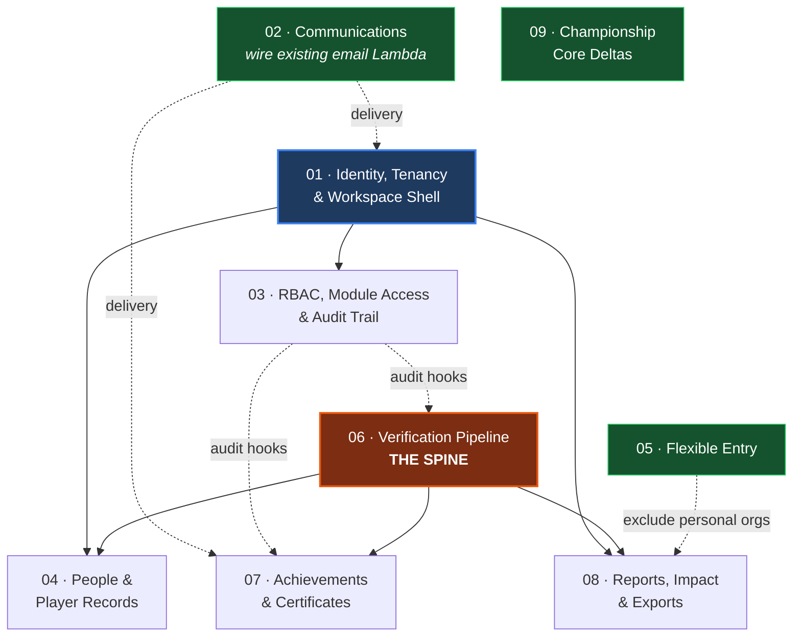

# Sportagon EOS — Organisation Workspace: Module Index

> Companion to `PRD - Sportagon EOS Org Workspace v1.md` (v1.0, 3 Aug 2026).
> This index maps the PRD onto the codebase as it actually stands, divides the work
> into build modules, and records the dependencies between them.
>
> **Status:** documentation phase. No code has been written and no migration applied
> against any of this. Every module doc is a proposal for review.
>
> **Runtime:** API on **AWS Lambda** + API Gateway HTTP API
> (`apps/api/src/lambda.ts` via `serverless-http`), web on Netlify, database on
> Supabase. **Render is retired.** See [`DEPLOYMENT.md`](../../DEPLOYMENT.md) and §2.3
> below — this constrains several modules.

---

## 1. How to read this doc set

The PRD is organised by *user-facing section* (6.1 Auth, 6.2 Nav, 6.3 Dashboard…).
That is the right shape for review but the wrong shape for building — several PRD
sections share one substrate (e.g. auth invitations, password reset and certificate
delivery all need the same email pipe that does not exist), and one PRD section can
span three teams.

So the work is divided into **nine build modules** instead. Each has its own doc:

| # | Module | Owns PRD sections | Doc |
| --- | --- | --- | --- |
| 01 | Identity, Tenancy & Workspace Shell | 6.1, 6.2, 6.3, 6.12 (FR-ADM-1) | [01-identity-tenancy-workspace.md](01-identity-tenancy-workspace.md) |
| 02 | Communications *(wire the existing email Lambda)* | *(none — cross-cutting)* | [02-communications.md](02-communications.md) |
| 03 | RBAC, Module Access & Audit Trail | 6.12 (FR-ADM-2/3/4) | [03-rbac-module-access-audit.md](03-rbac-module-access-audit.md) |
| 04 | People Directory & Player Lifetime Records | 6.4, 6.9 (FR-PRO-*) | [04-people-and-player-records.md](04-people-and-player-records.md) |
| 05 | Flexible Entry — solo & ad-hoc participation | *(none — new product requirement)* | [05-flexible-entry.md](05-flexible-entry.md) |
| 06 | Verification Pipeline & Result Integrity | 8.1, NFR immutability | [06-verification-pipeline.md](06-verification-pipeline.md) |
| 07 | Achievements & Certificates | 6.9 (FR-ACH-*), 6.10 | [07-achievements-certificates.md](07-achievements-certificates.md) |
| 08 | Reports, Impact & Export Service | 6.11 | [08-reports-impact-exports.md](08-reports-impact-exports.md) |
| 09 | Championship Core Deltas | 6.5, 6.6, 6.7, 6.8 | [09-championship-core-deltas.md](09-championship-core-deltas.md) |

Sequencing and rolled-up sizing live in [99-roadmap.md](99-roadmap.md). Journeys,
epics and user stories live in [`epics/`](epics/00-journey-map.md); the epic-level build
order is [`epics/01-execution-order.md`](epics/01-execution-order.md).

Every module doc uses the same ten-part template: Scope → What we have → What's
pending → What we could do → Data model → API → UI → Dependencies → Risks → Effort.

---

## 2. Where we actually are

### 2.1 The honest summary

The **competition engine is genuinely built and is the strongest part of the
product**. Four fixture generators (knockout, round-robin, groups, rankings) with
unit tests, a 1,726-line live scoring console covering five contest archetypes, a
standings engine with five schemes and most-specific-wins rule resolution, teams
decoupled from championships so a roster is reusable, enrolment/invitation/approval
flows, HMAC-signed public share pages, a spreadsheet-driven matrix importer, and a
per-client demo sandbox system with reset and teardown.

What is missing is **everything that makes it defensible as an institution's system
of record.** In blunt terms:

| Claim in the PRD | Reality in the repo |
| --- | --- |
| "permanent sports system of record" | Results can be silently overwritten forever. No lock, no audit, no history. |
| "verified achievement" | No verification state exists on a result or a person. |
| "automate certificate generation with QR verification" | Zero certificate code. No PDF or QR dependency anywhere. |
| "leadership-grade reporting… exportable" | No reports module. No PDF/Excel/PPT export of any kind. |
| "role-based access for the full operating hierarchy" | The `roles`/`permissions` tables exist and **nothing reads them**. |
| "strict org-level data isolation" | No RLS anywhere. `GET /api/organizations` is an open read of every org. |
| "invitation tokens expiring and single-use" | The API sends no email. A Lambda email service exists but has never been wired in, so invitations wait for the invitee to log in. |

None of that is a criticism of what was built — it is the natural shape of a product
that grew from the public/event side inward. But it is the entire distance between
"we run events" and "an institution can put its permanent record in this".

### 2.2 Numbers

- **Monorepo:** npm workspaces. `apps/api` (Express 4 + Prisma 5), `apps/web`
  (Vite + React 18 + React Router 6 + TanStack Query 5 + Tailwind v4),
  `packages/shared` (zod + enums, source-imported), `supabase/migrations`.
- **33 Prisma models**, **27 migrations**, **0 Postgres enum types** (every enum is a
  `varchar` + `CHECK`, mirrored in [`packages/shared/src/enums.ts`](../../packages/shared/src/enums.ts)).
- **0 RLS policies.** Deliberate and documented in three migration headers.
- **0 outbound message channels wired.** No mail dependency and no email service URL in
  [`config/env.ts`](../../apps/api/src/config/env.ts) — though a Lambda email service
  exists outside this repo, ready to be called.
- **UI is hand-rolled**, not shadcn — everything comes from
  [`apps/web/src/components/ui.tsx`](../../apps/web/src/components/ui.tsx) (~756 lines).

### 2.3 Working agreements that constrain every module

These are house rules, not suggestions. Every module doc assumes them.

1. **SQL first.** Hand-written idempotent migrations in `supabase/migrations/` are
   the schema source of truth. Prisma is **introspection-only** (`prisma db pull`) —
   never `prisma migrate`.
2. **Migrations must be re-appliable** — `if not exists`, guarded `do $$` blocks,
   matching the existing 27.
3. **Runtime uses the Supabase transaction pooler** (`:6543`, `connection_limit=5`);
   migrations need the session/direct port (`:5432`). `prisma generate` fails while
   the API server is running.
4. **Authorisation is server-side and real.** The client mirrors rules for UX only.
   See the header comment on
   [`permissions.ts`](../../apps/api/src/http/middleware/permissions.ts).
5. **Confirmations use `confirmDialog()`**, never `window.confirm`.
6. **The API is Lambda-only.** `apps/api/src/lambda.ts` wraps the same Express app via
   `serverless-http` behind API Gateway; it is proven on staging and **Render is
   retired**. Two consequences that shape several modules: there is **no long-lived
   process** for background work (see [07 §4.6](07-achievements-certificates.md) — SQS →
   worker Lambda), and any synchronous response is capped at the **15-second function
   timeout** set by `deploy-lambda.sh` (`TIMEOUT_SEC`), well inside API Gateway's own
   29s ceiling. Also relevant to every module: the function runs at **reserved
   concurrency 10 with `connection_limit=1` per container**, so the worst-case DB load
   is 10 pooled connections — any design assuming a shared in-process pool is wrong
   here. `render.yaml` and the "does not change local/Render behaviour" comment atop
   `lambda.ts` are now stale — cleanup tracked in [09](09-championship-core-deltas.md).
7. **Email is an external service.** A Lambda-hosted email service owns transport,
   retries and DNS. We render branded HTML and call it. See
   [02](02-communications.md).

---

## 3. Glossary — settling the vocabulary

The trigger for this whole exercise was that "organisation" means three different
things depending on who is speaking. This is the agreed vocabulary. **Use these terms
in code, UI copy and every future doc.**

| Term | Meaning | In the DB |
| --- | --- | --- |
| **Sportagon** | The company / the platform operator. | `users.is_super_admin` |
| **Organisation** | Any tenant row: a college, club, company, or a hidden personal entrant. The umbrella term. | `organizations` |
| **Community org** | The lightweight thing that exists today — anyone can create one, anyone can request to join, it can own teams and enter championships. | `organizations.kind = 'community'` *(proposed)* |
| **Institution** | A **verified** organisation with the full workspace: domain allow-list, programme/batch tree, module access, audit, certificates, reports. This is what the PRD means by "Organisation Workspace". | `organizations.kind = 'institution'` *(proposed)* |
| **Personal org** | An auto-provisioned, hidden organisation of exactly one person, created so a solo or ad-hoc entrant can use the existing entry machinery without schema surgery. Never appears in any directory. | `organizations.kind = 'personal'` *(proposed)* |
| **Org unit** | A Programme or Batch inside an institution. Hierarchical. | `org_units` *(proposed)* |
| **Entry** | A roster's participation in one championship. | `team_entries` |
| **Enrolment** | An organisation's approved participation in a championship. | `championship_organizations` |
| **Draw** | A sport+discipline within a season, holding the format and the fixtures. | `tournament_disciplines` |

### Dead vocabulary — stop using it

| Dead term | Why | Where it still lurks |
| --- | --- | --- |
| **POC** | Replaced by `organization_members.role ∈ owner\|admin` when membership became many-to-many. | [`PocsPage.tsx`](../../apps/web/src/pages/organization/PocsPage.tsx) (routed as "Members"), `InstitutionFormModal.tsx`, `poc_credentials` in the create-org response, `pocs_assigned` in matrix import, `poc` column kind in [`matrixImport.ts`](../../apps/web/src/lib/matrixImport.ts) |
| **Institution (as a table)** | Renamed to `organizations` in `20260616000000_rebrand_and_multitenancy.sql`. The word is being *reintroduced* above, but as a **tier**, never a table. | [`PlatformInstitutionsPage.tsx`](../../apps/web/src/pages/platform/PlatformInstitutionsPage.tsx), `InstitutionDashboard.tsx` (unrouted), legacy index names like `institutions_code_key` |
| **`users.account_type`** | Its CHECK and NOT NULL were dropped in the rebrand. Nothing authorises on it. | Still a nullable column; surfaced read-only in [`resources.ts`](../../apps/web/src/lib/resources.ts) and two pages; the demo seeder still writes `'participant'` |
| **Event** (as an entity) | Renamed to `championship`. "Event" now means only a *ranking event* (a team-less multi-competitor fixture). | Route params still say `:eventId`, page files still say `Event*` |

> **Naming debt is deliberately out of scope** for the feature modules — it is
> tracked as a single cleanup item in [09](09-championship-core-deltas.md) so it
> doesn't get smeared across nine workstreams.

---

## 4. Dependency graph



**Reading the graph:**

- **Solid arrows are hard blocks.** 06 must land before 04's lifetime profile, before
  07 at all, and before 08 can claim its numbers are trustworthy.
- **Dotted arrows are soft** — the downstream module can be built, but is incomplete
  or incorrect until the upstream lands.
- **02 (Communications) is small and unblocked.** A Lambda-hosted email service already
  exists; the API has simply never been wired to it. We render branded HTML, it
  delivers. That makes 02 an **S** with no upstream dependency, so FR-AUTH-3/4/6 and
  FR-CRT-2 are gated on a wiring task rather than a build. Sequence it in Phase 0 and
  nothing downstream ever waits on it.
- **05 and 09 are independent** and can run in parallel with anything, by anyone.

### The critical path

```
06 Verification Pipeline ──▶ 07 Certificates ──▶ 08 Impact Report
                         └─▶ 04 Lifetime Profile

01 Identity/Tenancy ──▶ 04 People ──▶ 08 Reports (programme/batch, D&I)
        ⋯ 02 email wiring feeds 01's auth flows and 07's delivery (soft)
```

If only one thing gets built this quarter, it should be **06**. It is small relative
to its leverage, and every "verified"/"permanent"/"immutable" claim in the PRD is
false until it exists.

> **The in-house notification service** ([`docs/notification-service-plan.md`](../notification-service-plan.md))
> is a **separate track**, not a module here. Its Supabase Realtime transport is under
> POC. Nothing in this doc set depends on the outcome — if Realtime doesn't work out,
> the existing 30-second poll stays and every module behaves identically.

---

## 5. PRD traceability matrix

All **67** functional requirement IDs in PRD §6, each assigned to exactly one owning
module with an honest verdict.

**Verdict key:** ✅ Have · 🟡 Partial · ❌ Absent

> Note: the PRD's §6.7 numbering skips **FR-EVD-5** (jumps from FR-EVD-4 to FR-EVD-6).
> Assumed to be an editing artefact, not a missing requirement. Flagged for the author.

### 6.1 Authentication & Organisation Access → Module 01 (+02)

| ID | Requirement | P | Verdict | Notes |
| --- | --- | --- | --- | --- |
| FR-AUTH-1 | Email-first login, domain → org identification | P0 | ❌ | No domain→org mapping exists for real users. Only demo sandboxes have `email_domain`. |
| FR-AUTH-2 | Domain allow-listing per org | P0 | ❌ | Needs new `org_domains` table. |
| FR-AUTH-3 | Password sign-in + Forgot Password | P0 | 🟡 | Password sign-in ✅ ([`auth.routes.ts`](../../apps/api/src/modules/iam/auth.routes.ts)). Forgot-password ❌ — needs 02's email wiring (small). |
| FR-AUTH-4 | OTP alternative, configurable per org | P1 | ❌ | No OTP code. Delivery via 02; email-OTP first, SMS only if funded. |
| FR-AUTH-5 | SSO — Google & Microsoft | P2 | ❌ | Zero OAuth/SAML references in the repo. |
| FR-AUTH-6 | Invitation link → password setup on first login | P1 | 🟡 | Three invite mechanisms exist; **none sends a link**. `must_change_password` ✅ and is directly reusable. Needs 02. |
| FR-AUTH-7 | Login screen org trust stats | P2 | ❌ | Requires FR-AUTH-1 to know which org to show. |

### 6.2 Workspace Shell & Navigation → Module 01

| ID | Requirement | P | Verdict | Notes |
| --- | --- | --- | --- | --- |
| FR-NAV-1 | Persistent sidebar with live-count badge | P0 | 🟡 | Sidebar ✅ ([`AppShell.tsx`](../../apps/web/src/components/AppShell.tsx)) but only two nav sets (`system`/`user`). No org-admin nav, no live badge. |
| FR-NAV-2 | Org identity block + "Verified" badge | P0 | ❌ | No org identity in the sidebar at all. |
| FR-NAV-3 | Sync/status strip with record counts | P1 | ❌ | — |
| FR-NAV-4 | Top bar breadcrumb, title, avatar, live indicator | P0 | 🟡 | Topbar with avatar + role switcher ✅. No breadcrumb, no live indicator. |
| FR-NAV-5 | Configurable merged/split nav | P1 | ❌ | Needs the feature-flag store from 01. |

### 6.3 Dashboard (Home) → Module 01

| ID | Requirement | P | Verdict | Notes |
| --- | --- | --- | --- | --- |
| FR-DASH-1 | Six live KPI cards | P0 | 🟡 | Per-championship StatCards exist ([`EventDashboard.tsx`](../../apps/web/src/pages/organiser/EventDashboard.tsx)); no org-level equivalent. |
| FR-DASH-2 | Pending actions queue with deep-link CTAs | P0 | 🟡 | "Needs your attention" exists per championship. Not org-wide; no Lock/Validate CTAs (those need 06/07). |
| FR-DASH-3 | Participation trend, 6 seasons, YoY | P1 | ❌ | Needs the aggregates from 08. |
| FR-DASH-4 | Upcoming & live events widget | P0 | 🟡 | Exists on participant + org overview; not on an org-admin home. |
| FR-DASH-5 | Recent achievements widget | P1 | 🟡 | Achievements exist but are thin ([`fixture_awards`](../../supabase/migrations/20260617020000_fixture_awards.sql) only). |
| FR-DASH-6 | "Create event" CTA → wizard | P0 | ✅ | [`CreateEventWizard.tsx`](../../apps/web/src/pages/organiser/CreateEventWizard.tsx) via `/host`. |

### 6.4 People — Player & Student Directory → Module 04

| ID | Requirement | P | Verdict | Notes |
| --- | --- | --- | --- | --- |
| FR-PPL-1 | Directory table with player ID, programme/batch, verification | P0 | ❌ | [`StudentsPage.tsx`](../../apps/web/src/pages/organization/StudentsPage.tsx) is team-grouped, not a person directory. No player ID, no programme/batch. |
| FR-PPL-2 | Verified/Pending/Rejected states + filter tabs | P1 | ❌ | `users` has only `is_active`. Pending/rejected exist for *membership*, not the person. |
| FR-PPL-3 | Free-text search + status filter | P0 | 🟡 | `useTableControls` ✅ ([`hooks.ts`](../../apps/web/src/lib/hooks.ts)); no directory to apply it to. |
| FR-PPL-4 | Add player + bulk CSV/XLSX import | P0 | 🟡 | [`BulkImportModal.tsx`](../../apps/web/src/components/BulkImportModal.tsx) exists and is excellent — wired to exactly one screen. `POST /organizations/:id/members/bulk` exists with **no UI attached**. |
| FR-PPL-5 | Row click → Lifetime Profile | P0 | ❌ | Profile is self-only, at `/profile`. |
| FR-PPL-6 | Verification workflow (approve/reject) | P1 | ❌ | — |

### 6.5 Teams & Squads → Module 09  *(struck through in PRD — "borrow from championship modules")*

| ID | Requirement | P | Verdict | Notes |
| --- | --- | --- | --- | --- |
| FR-TEAM-1 | Team cards grid with summary strip | P0 | 🟡 | [`TeamsPage.tsx`](../../apps/web/src/pages/organization/TeamsPage.tsx) is a table/list; no coach field. |
| FR-TEAM-2 | Create team with captain + coach | P0 | 🟡 | Everything except **coach** — no such value in `TEAM_MEMBER_ROLE`. |
| FR-TEAM-3 | Manage squad, assign captain/coach | P0 | 🟡 | [`RosterPage.tsx`](../../apps/web/src/pages/organization/RosterPage.tsx) is strong; coach missing. |
| FR-TEAM-4 | Status lifecycle Selection → Active | P1 | 🟡 | `TEAM_STATUS` has four values; only roster-lock is actually driven, and per-entry. |

### 6.6 Events — List & Creation → Module 09  *(struck through)*

| ID | Requirement | P | Verdict | Notes |
| --- | --- | --- | --- | --- |
| FR-EVT-1 | Events list with role + type + status | P0 | 🟡 | [`MyChampionshipsPage.tsx`](../../apps/web/src/pages/MyChampionshipsPage.tsx) + [`HostPage.tsx`](../../apps/web/src/pages/HostPage.tsx). No `type` field on `championships`; Organiser/Participant role is implicit. |
| FR-EVT-2 | Filters + sort | P0 | ✅ | Status tabs, sport filter, search. |
| FR-EVT-3 | Create wizard with draft state | P0 | ✅ | 4 steps, creates a draft at step 1. |
| FR-EVT-4 | Event templates for quick creation | P1 | 🟡 | Template *data* exists (`event-templates.ts`, `tie-templates.ts`, `demo-templates.ts`) but **no picker in the wizard** — resolved implicitly by sport name. |
| FR-EVT-5 | Row click → detail | P0 | ✅ | — |

### 6.7 Event Detail → Module 09  *(struck through)*

| ID | Requirement | P | Verdict | Notes |
| --- | --- | --- | --- | --- |
| FR-EVD-1 | Header + tabs (+ Status report when Organiser) | P0 | 🟡 | 9 tabs in [`championship-nav.ts`](../../apps/web/src/lib/championship-nav.ts) with `manage`-gating ✅. No **Live** tab, no **Status report** tab. |
| FR-EVD-2 | Overview: info grid, participants, share | P0 | ✅ | Incl. [`SharePublicLink.tsx`](../../apps/web/src/components/SharePublicLink.tsx). |
| FR-EVD-3 | Fixtures tab with score entry point | P0 | ✅ | [`SchedulePage.tsx`](../../apps/web/src/pages/organiser/SchedulePage.tsx). |
| FR-EVD-4 | Live match console with clock | P0 | 🟡 | Console is deep ([`MatchConsolePage.tsx`](../../apps/web/src/pages/official/MatchConsolePage.tsx), 1,726 lines) but lives at `/score/:fixtureId`, not as an event tab. No live clock. |
| *FR-EVD-5* | *(absent from the PRD)* | — | — | Numbering gap — confirm with author. |
| FR-EVD-6 | Results tab with Verified badge | P0 | 🟡 | Results tab ✅; "Verified" is meaningless until 06 exists. |
| FR-EVD-7 | Standings tab, auto-computed | P0 | ✅ | Strong — medal + points views, 10s refresh, per-org breakdown. |
| FR-EVD-8 | Status report tab (Organiser only) + export | P1 | ❌ | Nothing of that name. Export needs 08. |
| FR-EVD-9 | Bulk registration approval | P0 | 🟡 | [`ApprovalsPage.tsx`](../../apps/web/src/pages/organiser/ApprovalsPage.tsx) approves one at a time. |

### 6.8 Discover → Module 09  *(struck through)*

| ID | Requirement | P | Verdict | Notes |
| --- | --- | --- | --- | --- |
| FR-DIS-1 | Browse tournaments with filters | P0 | ✅ | [`DiscoverPage.tsx`](../../apps/web/src/pages/DiscoverPage.tsx). |
| FR-DIS-2 | Global directory incl. region, invited-private | P1 | 🟡 | Visibility flag ✅; no region/country dimension on `championships`. |
| FR-DIS-3 | Region chips + header stats | P1 | ❌ | No region data to filter on. |
| FR-DIS-4 | "Request to participate" + status tracking | P1 | 🟡 | Apply → `championship_organizations` ✅. No outbound-request tracker view. |

### 6.9 Achievements & Lifetime Profile → Modules 07 (ACH) + 04 (PRO)

| ID | Requirement | P | Verdict | Notes |
| --- | --- | --- | --- | --- |
| FR-ACH-1 | Org achievements page + share cards | P1 | ❌ | No org-level achievements view, no share-card generator. |
| FR-ACH-2 | Reverse-chronological verified feed | P0 | 🟡 | [`ParticipantAchievementsPage.tsx`](../../apps/web/src/pages/participant/ParticipantAchievementsPage.tsx) is self-only and derives from free-text `fixture_awards`. |
| FR-ACH-3 | Claims & validation queue | P1 | ❌ | — |
| FR-PRO-1 | Profile header with VERIFIED badge | P0 | 🟡 | Header ✅; nothing verified. |
| FR-PRO-2 | Timeline from locked events only, no manual edit | P0 | ❌ | **Blocked on 06** — there is no "locked". |
| FR-PRO-3 | Career stats auto-aggregated per sport | P0 | 🟡 | Five global counters via `GET /me/dashboard`. No per-sport split. |
| FR-PRO-4 | Verified credentials list | P1 | ❌ | Needs 07. |

### 6.10 Certificates & Credentials → Module 07

| ID | Requirement | P | Verdict | Notes |
| --- | --- | --- | --- | --- |
| FR-CRT-1 | Template gallery with issued counts | P0 | ❌ | Nothing. |
| FR-CRT-2 | Auto-generation + batch | P0 | ❌ | Nothing. Delivery via 02. |
| FR-CRT-3 | Generation queue & issued register | P0 | ❌ | Nothing. |
| FR-CRT-4 | QR → public verification page | P1 | ❌ | Nothing — but the unauthenticated public-route pattern in [`public.routes.ts`](../../apps/api/src/modules/public/public.routes.ts) is directly reusable. |
| FR-CRT-5 | Unique immutable numbering | P0 | ❌ | Nothing. |

### 6.11 Reports & Impact → Module 08

| ID | Requirement | P | Verdict | Notes |
| --- | --- | --- | --- | --- |
| FR-RPT-1 | Four report tabs, benchmark feature-flagged | P0 | ❌ | No `/reports` route exists. |
| FR-RPT-2 | Participation report with YoY | P0 | ❌ | — |
| FR-RPT-3 | Performance report | P1 | ❌ | — |
| FR-RPT-4 | Diversity & inclusion report | P1 | ❌ | Needs gender, DOB and a scholarship flag, none of which exist yet — ✅ **decided 2026-08-12 to collect all three** in [04a](04-people-and-player-records.md). Buildable once that lands. |
| FR-RPT-5 | Peer benchmark on anonymised aggregates | P1 | ❌ | Must exclude `kind='personal'` orgs. Hard privacy rule. |
| FR-RPT-6 | Annual Impact Report, PDF + PPT | P1 | ❌ | No export service. `xlsx` is present but **import-only**. |

### 6.12 Administration → Modules 01 (ADM-1) + 03 (ADM-2/3/4)

| ID | Requirement | P | Verdict | Notes |
| --- | --- | --- | --- | --- |
| FR-ADM-1 | Org structure tree (Institution → Programme → Batch) | P0 | ❌ | `organizations` is flat — no `parent_id`, no hierarchy. |
| FR-ADM-2 | Immutable audit trail of privileged actions | P0 | ❌ | No audit table. Only `created_at`/`updated_at` and scattered actor columns. |
| FR-ADM-3 | Roles & permissions table | P0 | 🟡 | **Facade.** Tables + CRUD screen exist; nothing reads `roles.permission_ids`. Real authz is hard-coded. |
| FR-ADM-4 | Module access toggles per audience | P0 | ❌ | No feature-flag store. |

### Coverage tally

| Verdict | Count | Share |
| --- | --- | --- |
| ✅ Have | 8 | 12% |
| 🟡 Partial | 26 | 39% |
| ❌ Absent | 33 | 49% |
| **Total** | **67** | |

By PRD priority the requirements split **43 P0 · 22 P1 · 2 P2**, and the P0 picture
alone is **8 Have · 20 Partial · 15 Absent**.

Read the "Partial" column carefully — it is the largest bucket and it is doing a lot of
work. In most cases it means *the championship-side capability exists and the
institution-side equivalent does not* (a per-championship dashboard but no org
dashboard; a team-grouped list but no people directory; a Results tab whose "Verified"
badge has no definition behind it).

---

## 6. Non-functional requirements — where they land

PRD §9 is not covered by the matrix above. Assignments:

| NFR | Owner | Verdict |
| --- | --- | --- |
| Multi-tenancy & isolation (P0) | 01 + 03 | ❌ No RLS, no tenant boundary. `GET /organizations` returns every org to any authenticated user. **Largest single security gap.** |
| Immutability & integrity (P0) | 06 | ❌ The whole point of module 06. |
| Live scoring latency ≤3s (P0) | 09 | 🟡 Polling-based today (10s standings refresh). No websockets. Needs measurement before it is called a gap. |
| Scale: 2,000 users / 25 concurrent live matches (P0) | — | ❓ Unverified. `perf-http.ts` and `perf-score.ts` probes exist in `apps/api/scripts/` but no published baseline. **Recommend a measurement task before committing to the number.** |
| Availability 99.5% (P1) | — | ❓ No SLO instrumentation. |
| Security: server-side authz, OTP rate-limit, expiring single-use tokens, audit (P0) | 03 + 01 + 02 | 🟡 Server-side authz ✅ and genuinely well-structured. Everything else ❌. |
| Privacy & retention, right-to-erase (P0) | 04 | ❌ No erasure flow. Note the direct tension with FR-PRO-2's immutable lifetime profile — **this needs a product decision**, recorded in [04](04-people-and-player-records.md). |
| Responsive web (P1) | — | ✅ Tailwind, desktop-first, mobile-readable. |
| Exports Excel/PDF/PPT (P1) | 08 | ❌ |

---

## 7. Open questions for the PRD author

Collected from every module doc so they can be answered in one pass.

1. **FR-EVD-5 is missing** from §6.7. Deleted requirement or numbering slip?
2. **Roles vocabulary.** §4 names Super Admin / Faculty Coordinator / Student
   Coordinator. The DB has `owner|admin|captain|member|alumni`. Are the PRD's three
   roles a *replacement*, or institution-tier labels layered on top? (See [03](03-rbac-module-access-audit.md).)
3. **D&I reporting needs gender and DOB** on a person (PRD §7 lists them; the schema
   has neither). Confirm we are collecting them, and confirm the consent copy.
4. **Right-to-erase vs immutable lifetime profile** — which wins, and what does
   "erased" mean for a locked result that another person's record depends on?
5. **Coach** is required by FR-TEAM-2/3 but is not a role anywhere. Is a coach a
   `team_members` role, an `organization_members` role, or a distinct entity?
6. **Certificate signatories** (FR-CRT-1) — per-org config, per-template, or per-event?
7. **Scale target of "2,000 consecutive users"** — read as concurrent? Needs
   confirming before it becomes an engineering commitment.

---

## 8. Change log

| Date | Change |
| --- | --- |
| 2026-08-12 | Initial gap analysis against PRD v1.0. Codebase snapshot: `main` @ `dac773a`, 27 migrations, 33 models. |
